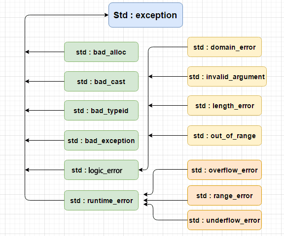

# 异常处理-命名空间

## 异常说明

- `noexcept`
  - 该关键字表示不会抛出异常(仅仅是规范)

```c++
void test() noexcept;
```

- 标准库异常



```c++
    try {
           throw std::runtime_error("test exception");
    }catch (...){
        auto e = std::current_exception();
        try {
            if (e)
            std::rethrow_exception(e);
        }catch(const std::exception& e2){
          std::cout<<"异常:"<<e2.what()<<std::endl;
        }
    }
```

## 命名空间

- 防止名字冲突提供了可控的机制,分割全局命名空间

- 命名空间定义
  - 命名空间不连续
  - 命名空间内的名字都必须表示空间内唯一实体
  - 空间内的其他实体可以直接访问,命名空间外的必须明确指出在那个空间内
  - 定义可以在命名空间的外部,但必须出现在所属命名空间的外层空间

```c++
namespace namespaceName{
}
```

>> 不要将`#include 放在`namespace`中

- 模版特例化
  - 必须定义在原始模版所需的命名空间中

- 嵌套的命名空间
  - 内层空间隐藏外层空间的同名成员
  - 嵌套的命名空间中定义的名字只在内层空间有效
  - 外层空间访问内层空间必须通过全限定名`外层::内层::成员名`

```c++
namespace namespaceName{
    namespace namespaceName2{
    }
    namespace namespaceName2{
    }
}
```

- 内联命名空间
  - 内联命名空间的名字能被外层空间直接访问

```c++
namespace namespaceName{
    //内联空间
    inline namespace namespaceName2{
    }
}
```

- 未命名的命名空间
  - 该空间中拥有静态生命周期
  - 只在文件内部有效,不能横跨多个资源
  - 可以直接使用

```c++
namespace{
}
```

- 命名空的别名

```c++
namespace newName=namespaceName;
```

- using声明
  - 引入莫个命名空间的成员
  - 只声明成员的名字
  - 容易出现二义性

- 类,命名空间和作用域
  - 统一查找规则为由内向外
    - 查找实参所需的命名空间
      - 如调用操作符时

- 友元
  - 没有实参的友元无法被找到

```c++
namespace A{
    class C{
        friend void  test();
        friend void  test2(C&);
    }
}
```

test函数隐式的成为命名空间A的成员`A::test()`无法被找到需要额外的声明

test2函数隐式的成为命名空间A的成员`A::test2(C&)`,因为实参的关系,可以被找到

## 多重继承

- 从多个直接基类中产生派生类的能力

```c++
class A :public C,B,C{
}
```

- 继承构造
  - 多个基类拥有完全相同的参数列表将产生错误
    - 必须定义自己版本的构造以及默认构造

## 虚继承

- 指同一个类被多次继承时,莫个类可以提供共享的基类
- 虚继承的类会先被构造

```c++
class D:public virtual A{}
```
