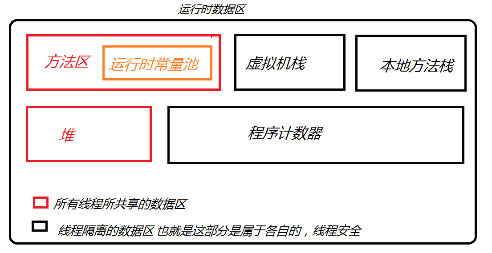

# 运行时数据区域

1. 程序计数器
    - 较小的内存块
    - 当前线程所执行的字节码的行号指示器
    - 取下一条字节码指令(分支,循环,跳转,异常处理,线程恢复)
    - 各条线程有用独立的程序计数器互相独立互不影响
    - 执行`Native`方法时计数器为空
2. 虚拟机栈
    - java方法执行的内存模型
       - 执行java方法时会创建一个**栈帧**(局部变量表,操作数栈,动态链接,方法出口等信息),进入到虚拟机栈中
    - 线程私有生命周期与线程相同
    - 相关异常
      - `StackOverflowError`
        - 线程请求的栈深度大于虚拟机允许的深度
      - `OutOfMemoryError`
        - 动态扩展时无法申请到足够的内存
3. 本地方法栈
    - 与**虚拟机栈**作用相同,为`Native`方法服务
4. 堆(GC堆)
   - 较大的内存块,被所有线程共享
   - 虚拟机启动时创建,存放对象实例
   - 是垃圾收集器管理的主要区域
   - 堆细分为
     - 新生代
       - `Eden`空间
       - `From Survivor`空间
       - `ToSurvivor` 空间
     - 老生代
     - 相关异常
       - `OutOfMemoryError`
         - 堆中没有内存完成实例分配,并且堆也无法扩展时
5. 方法区(非堆)
   - 所有线程共享
   - 存储虚拟机加载的类信息\常量\静态变量\即时编译器编译后的代码等数据
   -相关异常
      - `OutOfMemoryError`
        - 无法满足内存分配时
   - 运行时常量池
      - 是方法区的一部分
      - 用于存放编译期生成的字面量和符号引用,将在类加载后进入运行时常量池
            - 运行时也能进入常量池 如`String.intern()`
6. 直接内存
   - 不是虚拟机运行时的数据区域的一部分  
   - 通过`native`方法直接分配的堆外内存
     - 有助于提高性能避免

> 局部变量表编译器可知的各种基本数据类型(long和duble占用两个局部变量空间,其余都是一个),对象引用(初始地址的引用指针\代表对象的句柄或者其他与此对象相关的位置)和`returnAddress`类型(字节码指令地址)
