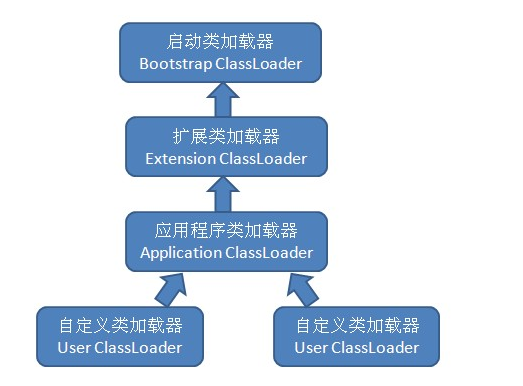

# 类加载器

通过类的全限定名来获取描述此类的二进制流,确定类在虚拟机中的唯一性  
两个类相同与否也取决于是否是同一个类加载器加载

## 双亲委派模型

- 启动类加载器(bootstartp ClassLoader)
  - 加载`${JAVA_HOME}/lib`下的类库
  - `-XBootclasspath`指定路径
- 其他类加载器(继承于`java.lang.ClassLoader`)
  - 扩展类加载器(Extension Classloader)
    - 加载`${JAVA_HOME}/lib/ext`或者java.ext.dirs系统变量路径中的类库
  - 应用程序类加载器(Application Classloader)
    - 加载用户类路径上指定的类库
    - 程序总默认的类加载器
  - 自定义类加载器
  


- 工作过程
   1. 收到类加载的请求,委派个上级加载
   2. 直至委派到顶层类加载器(Bootstarp)
   3. 顶层类加载器尝试加载
   4. 无法加载时反馈到下一级类加载器
   5. 逐级往下反馈

- 主要实现逻辑

```java
protected Class<?> loadClass(String name, boolean resolve)
    throws ClassNotFoundException{
    synchronized (getClassLoadingLock(name)) {
        // 检查是否被建筑
        Class<?> c = findLoadedClass(name);
        if (c == null) {
            long t0 = System.nanoTime();
            try {
                if (parent != null) {
                    c = parent.loadClass(name, false);
                } else {
                    c = findBootstrapClassOrNull(name);
                }
            } catch (ClassNotFoundException e) {
                // 父类加载器 抛出ClassNotFoundException
                // 父类加载器无法加载
            }

            if (c == null) {
                // 父类加载器无法加载时
                long t1 = System.nanoTime();
                    // 使用自身加载
                c = findClass(name);

                // 记录
                sun.misc.PerfCounter.getParentDelegationTime().addTime(t1 - t0);
                sun.misc.PerfCounter.getFindClassTime().addElapsedTimeFrom(t1);
                sun.misc.PerfCounter.getFindClasses().increment();
            }
        }
        if (resolve) {
            resolveClass(c);
        }
        return c;
    }
}
```