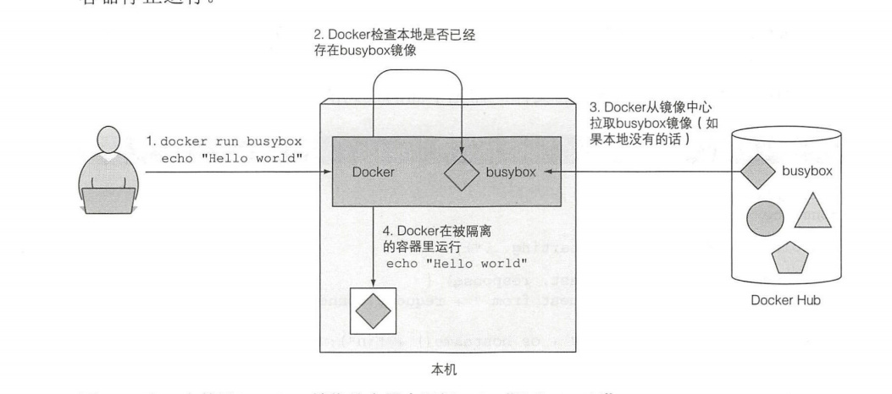

# 环境安装

## docker 安装

- 参考liunx环境部署中的,docker

```shell
docker run busybox echo ”Hello world”
```

- 运行过程



> `BusyBox`是一个集成了三百多个最常用Linux命令和工具的软件

### 构建应用容器的 dockerfile

- app.js

```js
const http=require("http");
const os =require("os");
console.log("测试用")
var heander=(req,rep)=>{
    console.log(`请求来源:${req.connection.remoteAddress}`)
    rep.writeHead(200);
    //liunx中os.hostname 返回的是个函数
    rep.end(`hostName:${os.hostname()}`)
}
var www=http.createServer(heander);
www.listen(9980)
```

- dockerfile

```dockerfile
FROM node:7
ADD app.js  /appjs
ENTRYPOINT ["node","app.js"]
```

- 构建容器镜像

  - `docker build -t node_app .`

- 运行容器

  - `docker run --name node_test -p 9980:9980 -d node_app`

- 进入容器

  - `docker exec -it 容器名 bash`

## 安装Kubernetes

- [安装kubectl参考](https://kubernetes.io/docs/tasks/tools/install-kubectl/#install-kubectl-on-linux)

- [安装Minikube参考](https://kubernetes.io/docs/tasks/tools/install-minikube/)
