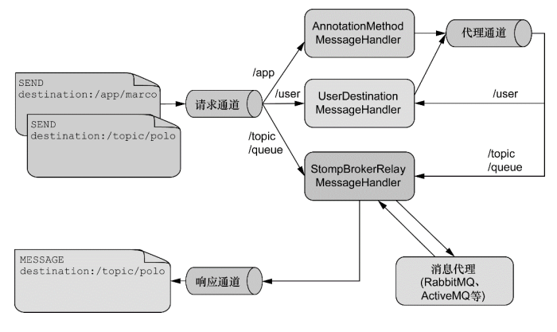

# webSocket



## 依赖

```yml
<dependency>
    <groupId>org.springframework.boot</groupId>
    <artifactId>spring-boot-starter-websocket</artifactId>
</dependency>
```

## 常用注解

- `@EnableWebSocketMessageBroker`
  - 使用`stomp` 协议

- 配置类

```java
@Configurable
@EnableWebSocketMessageBroker
@Slf4j
public class WebSocketConfig implements WebSocketMessageBrokerConfigurer {
    @Autowired
    private HandleShakeInterceptors handleShakeInterceptors;
    @Autowired
    private RegisterInterceptor registerInterceptor;
    /**
     * 端点
     */
    private final static String ENDPOINT = "/ws";
    private final static String ALLOWED_ORIGINS="*";
    @Override
    public void registerStompEndpoints(StompEndpointRegistry registry) {
                      //配置端点
        registry.addEndpoint(ENDPOINT)
                 //跨域
                .setAllowedOrigins(ALLOWED_ORIGINS)
                 //配置握手处理器
                .addInterceptors(handleShakeInterceptors)
                //允许降级处理 从ws降级为http
                .withSockJS();
    }

    @Override
    public void configureWebSocketTransport(WebSocketTransportRegistration registry) {
            //处理接收消息
    }

    @Override
    public void configureClientInboundChannel(ChannelRegistration registration) {
        //入方向拦截器
        registration.interceptors(registerInterceptor);
    }

    @Override
    public void configureClientOutboundChannel(ChannelRegistration registration) {
        //出方向拦截器
    }

    @Override
    public void addArgumentResolvers(List<HandlerMethodArgumentResolver> argumentResolvers) {
        //自定义解析器
    }

    @Override
    public void addReturnValueHandlers(List<HandlerMethodReturnValueHandler> returnValueHandlers) {
        //自定义返回值
    }

    @Override
    public boolean configureMessageConverters(List<MessageConverter> messageConverters) {
        //转换器 jsonStr->jabaBean
        return true;
    }

    @Override
    public void configureMessageBroker(MessageBrokerRegistry registry) {
        //定时任务
        ThreadPoolTaskScheduler te = new ThreadPoolTaskScheduler();
        //线程数
        te.setPoolSize(1);
        //线程名的前戳
        te.setThreadNamePrefix("wss-heartbeat-thread-");
        //初始化
        te.initialize();
        registry.enableSimpleBroker("/topic", "/queue")
        //设置心跳 0 表示服务器不发送心跳
        .setHeartbeatValue(new long[]{0,5000})
        //添加定时任务
        .setTaskScheduler(te);
        //客户端向服务端发起请求时，需要以/app为前缀。
        registry.setApplicationDestinationPrefixes("/app");
        //@SendToUser(""/{SimpleBroker}/自定义的路径) 
        //1 对1 发送
        registry.setUserDestinationPrefix("/user/");
    }


}
```

- `@SendTo(value)`
  - 转发至莫个内存队列

```java
    @MessageMapping("/message")
    @SendTo("/topic/subscribe/total")
    public WebSocket message(WebSocket webSocket){
        log.error(webSocket.toString());
        return webSocket;
    }
```

- `@SendToUser(value)`
  - 发送至`/user/{value}`

```java
@MessageMapping("/search")
//推送至"/user/queue/search"
@SendToUser("/queue/search")
public WebSocket message2(WebSocket webSocket){
    log.error("单通道");
    return webSocket;
}
```

- `@MessageExceptionHandler`
  - 异常处理

```java
@MessageExceptionHandler
@SendTo("/topic/error")
public WebSocket error(Exception e){
    WebSocket webSocket = new WebSocket();
    webSocket.setMessage(e.getMessage());
    return webSocket;
}
```

## 常用注入类

- `SimpMessagingTemplate`
  - 用于发送消息

- `SimpUserRegistry`
  - 用于获取连接上的用户集合
  - 需要入方向的连接器实现

- 入方向拦截器

```java
@Component
public class RegisterInterceptor implements ChannelInterceptor {
    @Autowired
    private PageStatService pageStatService;
    @Override
    public Message<?> preSend(Message<?> message, MessageChannel channel) {
        //这里是个新对象
        StompHeaderAccessor headerAccessor = StompHeaderAccessor.wrap(message);
        StompCommand command = headerAccessor.getCommand();
        if (command != null) {
            switch (command) {
                case CONNECT: {
                    //这个获取的是引用
                    StompHeaderAccessor accessorRef = MessageHeaderAccessor.getAccessor(message, StompHeaderAccessor.class);
                    //自定义对象
                    PageStatPo pageStat = new PageStatPo();
                    pageStat.setBeginTime(new Date());
                    IRegistry iRegistry = new IRegistry(accessorRef.getSessionId(),pageStat);
                    // 这里注入 对象 才能在 SimpUserRegistry 中获取到
                    accessorRef.setUser(iRegistry);
                    break;
                }
                case DISCONNECT: {
                    StompHeaderAccessor accessorRef = MessageHeaderAccessor.getAccessor(message, StompHeaderAccessor.class);
                    IRegistry registry =(IRegistry)accessorRef.getUser();
                    PageStatPo custom = registry.getCustom(PageStatPo.class);
                    custom.setEndTime(new Date());
                    custom.setStayTime(custom.getEndTime().getTime()-custom.getBeginTime().getTime());
                    //pageStatService.insertPageStat(custom);
                    break;
                }
                default:
                    break;
            }
        }

        return message;
    }

}
```

>> 自定义对象需要实现 `Principal`

## 心跳设置

- 需要一个 `ThreadPoolTaskScheduler` 对象
  - 作为响应或发送心跳

## 相关连接

[官方文档](https://docs.spring.io/spring-session/docs/current/reference/html5/guides/boot-websocket.html#exploring-the-websocket-sample-application)
