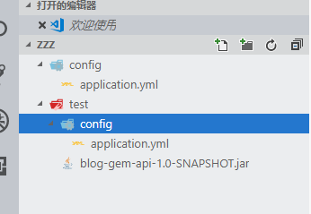
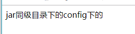

# springboot 配置文件和resources外置的问题

- 运行目录如下
  - 

1. 先在test目录下运行
   - 运行目录
      - 
   - 结果
      - 
      - 此处和网络中说的读取规则如下
          1. Jar包同级目录的config目录
          2. Jar包同级目录
          3. classPath(即resources目录)的config目录
          4. classpath目录

2. 在test外执行
   - 运行目录
     - 
   - 运行结果
     - 

- 结论
  - 这个和你执行的目录有关 而非jar 的位置
    - 我是怎么发现这个问题的
    - 是因为我用jenkins去部署才发现的
  - `liunx`下也是相同的这里为了方便直接在win中演示

## `-Dloader.path`

- 这种方法用来挂lib

## `spring.config.location`

- 执行目录
  - 
- 执行结果
  - 
- 说明执行是有效果的

>> 我的springboot 版本1.5.8

## resources和依赖外置

- pom.xml 如下配置

```xml
<build>
        <!--不打包任何资源文件-->
        <resources>
            <resource>
                <directory>src/main/resources</directory>
                <excludes>
                    <exclude>**/*</exclude>
                </excludes>
            </resource>
        </resources>
        <plugins>
            <!--拷贝lib-->
            <plugin>
                <groupId>org.apache.maven.plugins</groupId>
                <artifactId>maven-dependency-plugin</artifactId>
                <executions>
                    <execution>
                        <id>copy-dependencies</id>
                        <phase>package</phase>
                        <goals>
                            <goal>copy-dependencies</goal>
                        </goals>
                        <configuration>
                            <outputDirectory>target/lib</outputDirectory>
                            <excludeTransitive>false</excludeTransitive>
                            <stripVersion>false</stripVersion>
                            <includeScope>runtime</includeScope>
                        </configuration>
                    </execution>
                </executions>
            </plugin>

            <plugin>
                <groupId>org.springframework.boot</groupId>
                <artifactId>spring-boot-maven-plugin</artifactId>
                <configuration>
                 <!--启动类-->
                  <mainClass>top.ccxh.web.ApplicationAction</mainClass>
                     <!--一定要是zip方式-->
                    <layout>ZIP</layout>
                    <executable>true</executable>
                    
                    <includes>
                    <!--需要导入的依赖-->
                        <include>
                        <!--不导入-->
                            <groupId>nothing</groupId>
                            <artifactId>nothing</artifactId>
                        </include>
                    </includes>
                    <excludes>
                        <!--需要排除的依赖-->
                    </excludes>
                    <!--<classifier>exec</classifier>-->
                </configuration>
                <executions>
                    <execution>
                        <goals>
                            <goal>repackage</goal>
                        </goals>
                    </execution>
                </executions>
            </plugin>
            <plugin>
                <groupId>org.apache.maven.plugins</groupId>
                <artifactId>maven-compiler-plugin</artifactId>
                <configuration>
                    <source>1.8</source>
                    <target>1.8</target>
                </configuration>
            </plugin>
            <plugin>
                <groupId>org.apache.maven.plugins</groupId>
                <artifactId>maven-surefire-plugin</artifactId>
                <version>2.19.1</version>
                <configuration>
                    <!--默认关掉单元测试 -->
                    <skipTests>true</skipTests>
                </configuration>
            </plugin>

        </plugins>

    </build>

```

> 可以使用 在`<includes>`,`<excludes>` 自定义搭配

- 修改yml

```yml
spring:
  mvc:
    view:
      suffix: .ftl
  resources:
    # 修改静态资源父目录
    static-locations: file:C:/Users/ccxh/Desktop/test/resources/public
  freemarker:
    charset: UTF-8
    content-type: text/html; charset=utf-8
     # 修改模板引擎 
    template-loader-path: file:C:/Users/ccxh/Desktop/test/resources/ftl/
    cache: false
  http:
    multipart:
      max-file-size: 100MB
      max-request-size: 100MB
```

- 启动jar
  - `java -Dloader.path=./lib  -jar product-web-1.0-SNAPSHOT.jar --spring.config.location=C:\Users\ccxh\Desktop\test\resources\config\`
    - `spring.config.location` 指定配置文件所在目录
    - 使用`windows PowerShell`执行会出现错误提示 `错误: 找不到或无法加载主类 loader.path=..lib`
      - 需要放在脚本中执行
    - `cmd`可以正常使用
