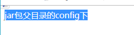

# springboot 配置文件外置的问题 

- 运行目录如下
  - 

1. 先在test目录下运行
- 运行目录
    - 
- 结果
    - 

    - 此处和网络中说的读取规则如下 
        1. Jar包同级目录的config目录
        2. Jar包同级目录
        3. classPath(即resources目录)的config目录
        4. classpath目录
2. 在test外执行
- 运行目录
    -  
- 运行结果
    - 

- 结论 
 - 这个和你执行的目录有关 而非jar 的位置
    - 我是怎么发现这个问题的 
        - 是因为我用jenkins去部署才发现的
 - `liunx`下也是相同的这里为了方便直接在win中演示

## `-Dloader.path`
- 这种方法一般用来挂lib

## `spring.config.location`
- 执行目录
    - 
- 执行结果
    - 
- 说明执行是有效果的

>> 我的springboot 版本1.5.8