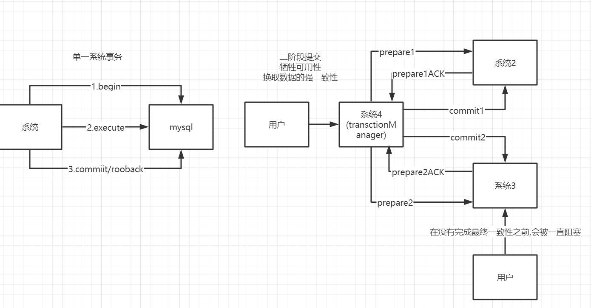

# 分布式事务

## CAP

1. 一致性(consistency)
     - 一系列操作是可以保证一致和同时发生的
2. 可用性(Availability)
     - 每个操作都必须有可预期的响应
3. 分区容错性(Partiton tolerance)
     - 出现单个组件无法可用,操作依然可以完成

> 三者不可兼得,在分布式系统中分区容错必须保证,一致性和可用性之间的权衡

## Base

1. 基本可用 (Basically Available)
     - 保证核心功能或者当前最重要功能可用
2. 软状态 (Soft state)
     - 软状态允许系统数据存在中间状态,保证弱一致
     - 为保证基本可用
3. 最终一致性(eventually consistent)
     - 保证数据的最终一致

## 分布式事务常见四种解决方案

### 二阶段提交

保证强一致性和分区容错性

- 读写同步
  - 异步同步
    - 访问的集群节点写成功就返回成功
    - 吞吐量最高,只能保证数据的最终一致性,异步同步过程中导致数据不一致
  - 同步同步
    - 强制要求集群中所有的节点写成功,才会成功
    - 当莫个节点同步失败,导致其他节点拥有了超前数据或脏数据
    - 配合二阶段才能完成数据的强一致性,杜绝超前数据
    - 降低了吞吐量
  - raft同步
    - n/2+1的节点写成功就返回成功
    - 相比较同步同步提高吞吐量

> raft同步 n/2+1,由选主机制决定,保证数据

### 异步确保型

1. 保证可用性和分区容错性和最终一致性

2. 最终一致性会有一定时间查

3. 通过消息中间件进行生产/消费模型

4. 依赖消息中间件本地持久化和重试机制

> 重复发送时,应该要通过乐观锁的机制保证数据正确性

### 事务性消息

1. 确保生产者消息发送成功的能力
2. 类似二阶段提交
     - prepare消息
       - 当没有后续rollback消息和commit消息,消息中间会定时回查
     - rollback消息
     - commit消息

### TCC型

1. 仿造二阶段提交在应用层面进行了抽象
     - try
     - cancel
     - confirm
2. 无需锁定资源,只需要锁定在当前本地事务中
3. 保证可用性和分区容错性和最终一致性
4. 通过软状态,数据日志的记录和单个事务中的乐观锁或悲观锁达到数据的可用性

> 作为`transctionManage`的系统出现问题,可以使用定时任务捞取脏数据,根据相应软状态进行`cancel`或`confirm`

## 参考

[TCC型](https://www.cnblogs.com/jajian/p/10014145.html)

[TCC型](http://www.tianshouzhi.com/api/tutorials/distributed_transaction/388)

[事务性消息](https://zhuanlan.zhihu.com/p/53119404)

[异步确保型](https://www.kancloud.cn/sql-jdxia/mysql/513207)

[二阶段提交](https://zhuanlan.zhihu.com/p/111304281)
