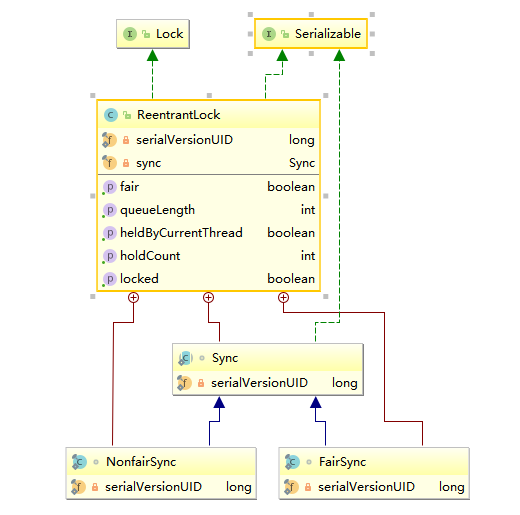
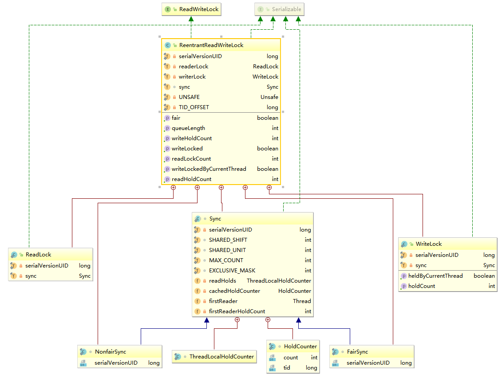

# 并发包

## CopyOnWriteArrayList

线程安全的`list`,写时复制策略(修改操作都是在底层的一个复制数组)

- 源码分析

```java
public boolean add(E e) {
    final ReentrantLock lock = this.lock;
    //独占锁
    lock.lock();
    try {
        Object[] elements = getArray();
        int len = elements.length;
        //copy源数组并长度+1
        Object[] newElements = Arrays.copyOf(elements, len + 1);
        newElements[len] = e;
        //设置源数组
        setArray(newElements);
        return true;
    } finally {
        //释放独占锁
        lock.unlock();
    }
}
```

- 弱一致性
  - 返回迭代器后,其他线程的操作不影响该线程

>> 无界list

## LockSupport

工具类,主要作用挂起和唤醒线程,是创建锁和其他同步类的基础

### 常用方法

- park
  - 调用该方法的线程,将被禁止参与线程调度,除非已经拥有`LockSupport`相关许可证
    - 被中断(`interrrupt`)时,会立即返回,不会抛出中断异常

```java
public static void main(String[] args) {
    LockSupport.park();
    System.out.println("begin");
}
```

- unpark
  - 发放许可证或唤醒被`park`的线程

```java
public static void main(String[] args) throws Exception {
    Runnable task=()->{
        for (;;){
            System.out.println("begin");
            //第1+n次时需要重新unpark
            LockSupport.park();
            System.out.println("end");
        }
    };
    Thread thread = new Thread(task);
    thread.start();
    Thread.sleep(2000);
    LockSupport.unpark(thread);
}
```

```java
public static void main(String[] args) throws Exception {
    LockSupport.unpark(Thread.currentThread());
    //释放
    LockSupport.park();
    System.out.println("park-1");
    //阻塞
    LockSupport.park();
    System.out.println("park-2");
}
```

- parkNanos
  - `park`类似 允许nanos时间内返回

## 抽象同步队列AQS

FIFO双向队列,内部通过`head`和`tail`记录首尾元素,元素类型为`Node` 

以下为`node`类型的重要属性

- `node`
  - `thread`
    - 存放进入`AQS`队列的线程
  - `SHARED`
    - 标记线程是获取共享资源时被阻塞挂起后进入`AQS`
  - `EXCLUSIVE`
    - 标记线程是获取独占资源时被挂起后进入`AQS`
  - `waitStatus`
    - 当前线程的等待状态
      - `CANCELLD`
        - 线程被取消
      - `SIGNAL`
        - 需要被唤醒
      - `CONDITION`
        - 在条件队列里等待
      - `PROPAGATE`
        - 释放节点时需要通知其他节点
  - `prev`
    - 记录前驱节点
  - `next`
    - 记录后续节点

AQS还维持了一个单一的状态信息state

- state
  - `ReentrantLock`
    - 获取锁可冲入的次数
  - `ReentrantReadWriteLock`
    - 高16位表示读状态,获取该读锁的次数
    - 低16位,写锁的可重入次数
  - `semaphore`
    - 当前可用信号数
  - `CountDownlatch`
    - 计数器当前的值

## AQS 条件变量

`signal`和`await`是配合AQS实现线程间同步的基础设施  
调用`signal`,`await`时必须获取条件变量对应的锁


- 示例

```java
public class App10 {

    public static void main(String[] args) {
        ReentrantLock lock = new ReentrantLock();
        Condition condition = lock.newCondition();

        Thread awaitThread = new Thread(() -> {
            lock.lock();
            try {
                println("begin await");
                /*
                 *没有上锁时抛出java.lang.IllegalMonitorStateException
                 * 释放锁
                 */
                condition.await();
                //获取锁
                println("end await");
            } catch (InterruptedException e) {
                e.printStackTrace();
            } finally {
                lock.unlock();
            }
        });
        awaitThread.start();

        Thread signal = new Thread(() -> {
            lock.lock();
            try {
                println("begin signal");
                condition.signal();
                println("end signal");
            } catch (Exception e) {
                e.printStackTrace();
            } finally {
                lock.unlock();
            }

        });
        try {
            Thread.sleep(2000);
        } catch (InterruptedException e) {
            e.printStackTrace();
        }
        signal.start();

    }

    public static void println(String message) {
        System.out.println(System.currentTimeMillis() + ":" + message);
    }
}
```

- ReentrantLock 可重入独占锁
使用aqs实现,默认非公平锁
  - 类图

    

- reentrantReadWriteLock 读写锁
读写分离,允许多个线程获取读锁,具有重入性  
aqs的状态值高16位表示读锁的个数,低16位为可重入次数
  - 类图

    

- stampedLock
提供三种读写控制,调用获取锁函数会获取一个`long`变量称为`stamp`(代表锁状态),释放和转换锁时需要`stamp`
  - jdk1.8新增
  - 写锁writeLock
    - 排它锁,独占锁
    - 不可重入
  - 悲观读锁 readLock
    - 共享锁
    - 没有线程获取独占写锁时,多个线程可同时持有该锁
    - 不可重入
  - 乐观写锁 tryOptimisticRead
    - 没有使用`cas`设置锁状态,通过位运算测试
    - 需要验证`stamp`是否可用(有线程持有写锁时会返回0))
